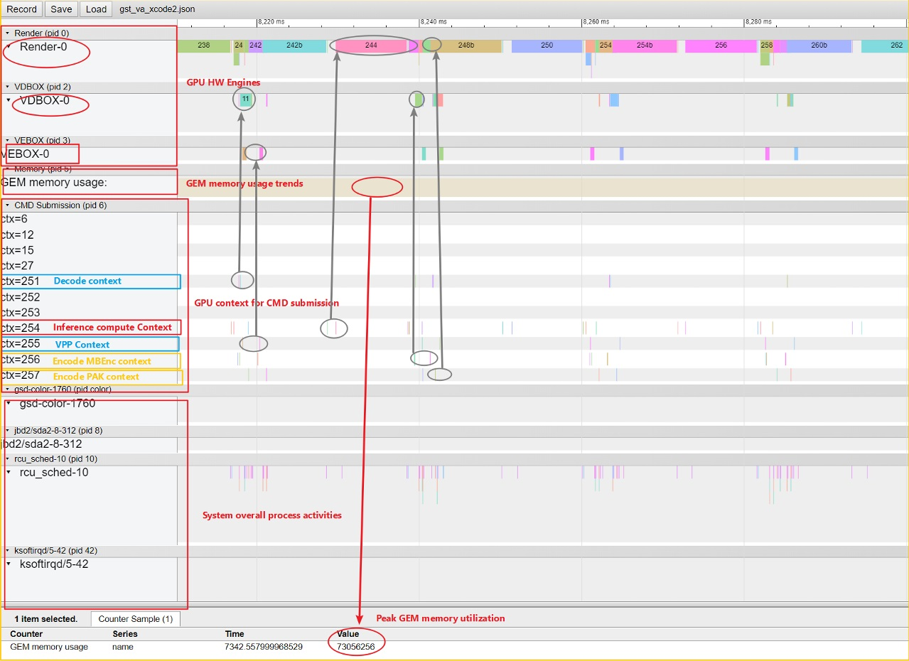

# drm-trace-visualizer BKM

## **Step 0: prerequisite** 

#### a). rebuild linux kernel to enable i915/drm low-level trace

for open source kernel, please refer to this [link](./kernel.md) for BKM

for internal kernel, please refer to this [link](./kernel-internal.md) for BKM

#### b). install trace-cmd

```bash
sudo apt install trace-cmd

# to verify i915 low level trace is enabled 
sudo trace-cmd list | grep i915

# if the low level drm trace is enabled correctly, it will print below event list
i915:intel_cpu_fifo_underrun
i915:intel_pch_fifo_underrun
i915:intel_memory_cxsr
i915:g4x_wm
i915:vlv_wm
i915:vlv_fifo_size
i915:intel_update_plane
i915:intel_disable_plane
i915:i915_pipe_update_start
i915:i915_pipe_update_vblank_evaded
i915:i915_pipe_update_end
i915:i915_gem_object_create
i915:i915_gem_shrink
i915:i915_vma_bind
i915:i915_vma_unbind
i915:i915_gem_object_pwrite
i915:i915_gem_object_pread
i915:i915_gem_object_fault
i915:i915_gem_object_clflush
i915:i915_gem_object_destroy
i915:i915_gem_evict
i915:i915_gem_evict_node
i915:i915_gem_evict_vm
i915:i915_gem_ring_sync_to
i915:i915_request_queue
i915:i915_request_add
i915:i915_request_submit
i915:i915_request_execute
i915:i915_request_in
i915:i915_request_out
i915:intel_engine_notify
i915:i915_request_retire
i915:i915_request_wait_begin
i915:i915_request_wait_end
i915:i915_reg_rw
i915:intel_gpu_freq_change
i915:i915_ppgtt_create
i915:i915_ppgtt_release
i915:i915_context_create
i915:i915_context_free
```

#### c). generate trace.sh

```bash
python3 gen_sh.py
```


## **Step 1: capture drm trace log**

#### a). copy "trace.sh" script to target linux system and run below command

```bash
./trace.sh
```

#### b). run your application
```bash
# run your application in terminal/GUI as usual
run application
```
**Note**: docker container environemtn is also supported

#### c). Ctr+C to stop trace capture

#### d). run below command to convert trace data to trace log
```bash
trace-cmd report >your_trace_log_file.log
```

## **Step 2: generate chrome tracing json file from trace log**

#### it can be run either on Linux or Windows

```bash
# Windows command line
python trace2json.py your_trace_log_file.log
```

```bash
# Linux command line
python3 trace2json.py your_trace_log_file.log
```

**Note**: you can use "-a" option in command line, which will build graphs for all i915 scheduling events (very helpful for inspecting i915 scheduling flow)

## **Step 3: visualize trace**

#### open chrome browser (either on Windows or Linux), type "chrome:://tracing" in the address bar, click "Load" button and load the json file generated from previous step.

**Note**: press "?" botton in the top right corner to get help about how to navigate the visualization graph

## Alternative usage with auto.py

Execute application + trace-cmd + trace2json

```bash
python3 auto.py "app_cmd_line"
# or
python3 auto.py run.sh
```

## **visualization graph example**


